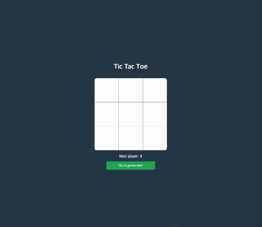

## TicTacToe앱 만들며 리액트 익히기

### 🗂️ React 강의 자료

1. 리액트란? https://drive.google.com/file/d/1idYPxZ-D9fCU0oOUEFOikwzjqOig4r4x/view?usp=sharing

2. TicTacToe 앱 만들며 리액트 익히기 https://drive.google.com/file/d/1OgwWqBfs1FSAHr8vvKOCFLqszP2UBmMf/view?usp=sharing

3. TicTacToe 앱 함수형 컴포넌트로 변경하기 https://drive.google.com/file/d/1iT8Sh_Qk6OPZjeXgJLVIQdx5RTJMTu_I/view?usp=sharing

4. TicTacToe 앱 시간 여행 추가하기 https://drive.google.com/file/d/1XFZrujbBgXd2p246F4QYVqLrE9NmZhTU/view?usp=sharing

 

### 🎥 구현 화면

|                                    구현 화면                                     |
| :------------------------------------------------------------------------------: |
|  |
